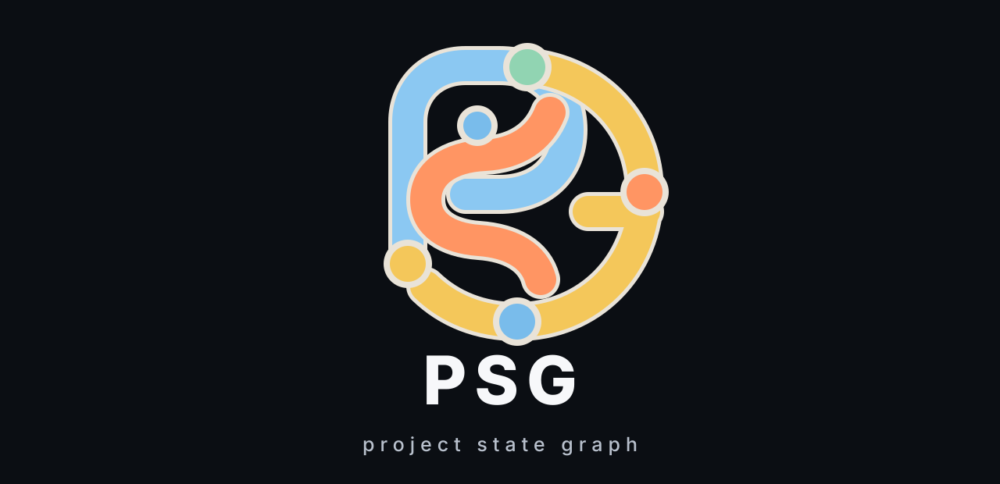
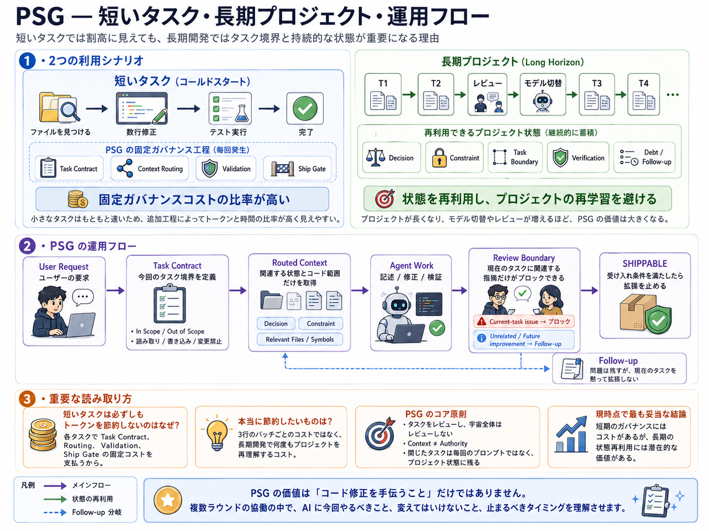
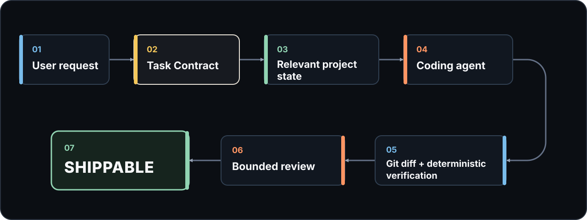

<div align="center">



[English](README.md) · [繁體中文](README.zh-TW.md) · [简体中文](README.zh-CN.md) · **日本語**

</div>

# PSG — Project State Graph

**AI コーディングエージェントをタスクの内側に保ち、セッションをまたいでプロジェクトの決定を残し、いつ作業が終わったかを明確にします。**

PSG はコーディングエージェントに永続的なタスク境界とプロジェクト状態を与えます。モデルが変わるたびに repository を探索し直し、スコープを定義し直す必要はありません。

## インストール

### Windows

```powershell
python -m pip install "psg-runtime[mcp] @ git+https://github.com/niansia/PSG.git@v1.1.4"; psg setup
```

### macOS / Linux

```bash
python3 -m pip install "psg-runtime[mcp] @ git+https://github.com/niansia/PSG.git@v1.1.4" && psg setup
```

次に、Git プロジェクト内で実行します。

```text
psg init
```

これだけです。あとは Codex、Claude Code、Gemini CLI をいつもどおり使ってください。

### 日常の操作

```text
psg status
psg on
psg off
```

## PSG は何をするのか

PSG がなければ、コーディングエージェントはさらに多くのファイル、リファクタリング、レビュー提案を見つけ続け、小さなタスクをプロジェクト全体の書き直しへ広げてしまうことがあります。

PSG は、すべてのタスクに 4 つの境界を与えます。

- **Context boundary（コンテキスト境界）** — エージェントが何を読む必要があるか。
- **Mutation boundary（変更境界）** — 何を変更してよいか。
- **Review boundary（レビュー境界）** — どの指摘が現在のタスクを止められるか。
- **Completion boundary（完了境界）** — いつタスクが完了し、レビューを止めるべきか。

レビュー担当者は無関係なバグや将来の改善点も発見できますが、PSG はそれらを follow-up として記録し、現在のタスクを暗黙に拡大しません。

> **Review the task, not the universe. — レビューするのはタスクであって、宇宙全体ではありません。**

## PSG を使う理由

### 1. スコープの漂流を止める

A だけを直すはずのタスクが、別のモデルが B、C、D の改善点を見つけたという理由だけで A + B + C + D にはなりません。

### 2. プロジェクトの決定を残す

承認済みの decision、constraint、frozen boundary、known debt を、エージェントやセッションが変わるたびに説明し直す必要がありません。

### 3. レビューを収束させる

現在の patch が生んだ regression、受け入れ条件違反、プロジェクト制約違反だけが現在のタスクを阻害できます。それ以外の finding は follow-up として残り、タスクを再オープンしません。

### 4. 止めどきを知る

受け入れ条件、決定論的な検証、guardrail、現在のタスクの blocker がすべて一致すると、gate は次を返します。

```text
SHIPPABLE
```

一般レビューはそこで終わります。

## 短いタスクと長期プロジェクト



## 過去の A/B 結果（現在は無効）

> **証拠の状態：Superseded。**

**この実験は透明性のために保存していますが、現行版の性能を示す証拠ではありません。当時 Codex が読み込んだ PSG Skill はテスト対象の Runtime より古く、その後 retrieval integration も変更されました。**

この過去の実験には、同じモデル、プロンプト、repository baseline を使用した Codex CLI の 10 組のペアタスクが含まれます。

| 指標 | PSG OFF | PSG ON |
| --- | ---: | ---: |
| **タスク成功** | 9 / 10 | **10 / 10** |
| 対象外ファイルの編集 | 10 | **2** |
| Regression | 0 | 0 |
| 誤った `SHIPPABLE` | 0 | 0 |

この過去の実験は、**より良いタスク境界の規律を示した一方で、測定可能な token と latency のオーバーヘッドも伴いました**。ただし、この実験は superseded であり、現行版の性能を示す証拠ではありません。PSG は現在、この結果に基づく token や時間の節約を主張しません。

完全な protocol、生データ、制限事項は [benchmark ドキュメント](benchmarks/README.md)を参照してください。

## 仕組み



実装内容の source of truth は引き続き Git です。PSG が保存するのは永続的な決定とタスク状態であり、会話全体ではありません。必要なら context は広げられますが、書き込み権限まで暗黙に広がることはありません。

## PSG を使える場所

| モード | Host | 機能 |
| --- | --- | --- |
| **フル実行** | Codex、Claude Code、Gemini CLI | 読み取り、編集、検証、強制、ship |
| **Review / handoff** | ChatGPT、Claude、Gemini | 同じ Task Contract に対するレビュー |

すべての host が同じ Task Boundary を利用でき、フル実行 host には runtime enforcement も加わります。`psg handoff` で、別のモデルや共同作業者向けの簡潔な review pack を作成できます。

## 現在の制限

- 詳細な symbol indexing は Python 中心で、その他の言語はファイル単位です。
- 収録された agentic benchmark は小規模な生成 repository を使っており、本番プロジェクトではありません。
- 現在のローカライズ動作には、新しい matched A/B 実験が必要です。
- 認証済み外部 CI attestation adapter はまだありません。
- PSG は変更を統治・評価しますが、実際にコードを編集するのはコーディングエージェントです。

## 詳細ドキュメント

- [インストールと host 設定](docs/installation.md)
- [Task Contract と review boundary](docs/task-contract.md)
- [信頼・セキュリティモデル](docs/trust-and-security.md)
- [CLI・MCP リファレンス](docs/cli-and-mcp.md)
- [アーキテクチャ](docs/architecture.md)
- [受け入れ・release の証拠](docs/acceptance.md)
- [Benchmarks](benchmarks/README.md)
- [リサーチ](research/README.md)

別の [mechanics regression benchmark](benchmarks/README.md#3-mechanics-regression-benchmark) は、関連する対象が既知の場合に routing が選択 context を減らせることを検証します。これはエンドツーエンドの Agent token 節約を示す主張ではありません。

PSG は長期的なソフトウェア Agent 研究システムとしても評価中です。[評価計画](research/evaluation-plan.md)を参照してください。

## ライセンス

[MIT](LICENSE)
