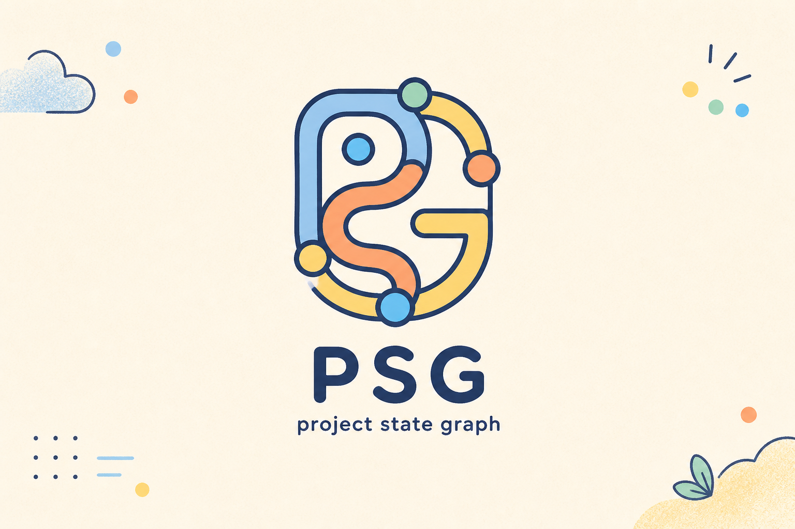

<div align="center">



# PSG / WorkGraph

### Give coding agents a project memory, a safe working boundary, and a real finish line.

[](https://www.python.org/)
[](tests/)
[](artifacts/)
[](docs/acceptance.md)

</div>

## What is this?

**PSG (Project State Graph)** is the idea: keep the important state of a software project in one persistent graph instead of making every AI session rediscover it from scratch.

**WorkGraph** is the working reference implementation in this repository. It gives a coding agent only the context it needs, checks what it is allowed to change, records test and review evidence, and decides whether a task is actually ready to ship.

It sits beside your existing agent and Git workflow. It does **not** generate patches, replace Git, or choose a model for you.

> In plain English: WorkGraph helps an AI coding assistant remember the project, stay in scope, prove its work, and stop when the work is done.

## Why would I use it today?

WorkGraph is useful when one or more of these feel familiar:

- A new chat spends time reading the same repository files again.
- Important decisions disappear when you switch models or sessions.
- A small request causes unrelated files to change.
- "Review it again" produces endless low-value review loops.
- Tests passed once, but the code changed afterward and the evidence became stale.
- You cannot explain why an agent believed a task was complete.

WorkGraph turns those fuzzy problems into four explicit controls:

| Need | What WorkGraph does |
| --- | --- |
| **Relevant context** | Indexes files and Python symbols, follows dependencies, and builds a token-budgeted context pack. |
| **Safe changes** | Applies `mutable`, `read_only`, `interface_locked`, or `frozen` policies to the real Git diff. |
| **Durable evidence** | Records acceptance criteria, verification results, issues, decisions, and review rounds in local project state. |
| **A finish line** | Returns `SHIPPABLE` only when the current worktree, evidence, criteria, scope, and review budget agree. |

## The workflow

```text
TASK INTENT → MINIMUM CONTEXT → CONTROLLED CHANGE → CURRENT EVIDENCE → SHIP GATE
                  ↑                    ↓                  │
                  └── project graph ← decisions / issues / verification ──┘
```

1. **Open a task** with targets, constraints, non-goals, and acceptance criteria.
2. **Build context** from the project graph instead of loading every file.
3. **Let your coding agent work** while Git remains the source of truth.
4. **Validate and verify** the current diff, then evaluate the ship gate.

## Try it in five minutes

You need Python 3.10+ and a Git repository.

```powershell
git clone https://github.com/niansia/PSG.git
cd PSG
python -m pip install -e ".[mcp]"

workgraph init
workgraph index
workgraph doctor
```

Open a real task and ask for the smallest useful context pack:

```powershell
workgraph task open "Add an empty-cart message" `
  --target src/cart.py `
  --write src/cart.py `
  --ac "An empty cart shows a helpful message"

workgraph context build T-0001
```

After your agent edits the code, validate the actual Git diff and run deterministic checks:

```powershell
workgraph validate T-0001
workgraph verify T-0001 --check "tests=pytest -q"
workgraph task criterion T-0001 T-0001-AC1 pass --evidence '{"source":"pytest"}'
workgraph ship T-0001
```

Every command returns structured JSON. Run `workgraph --help` to see the complete CLI.

## Use it as an agent Skill

This repository includes both parts needed for agent use:

- [`skills/workgraph/`](skills/workgraph/) is the reusable Skill bundle source. `SKILL.md` is the entry point; the `references/` and `agents/` folders are supporting resources.
- [`artifacts/workgraph-skill-v1.0.0.zip`](artifacts/workgraph-skill-v1.0.0.zip) is the distributable Skill bundle.
- `workgraph-mcp` starts the local MCP server over stdio so an agent can call WorkGraph as tools.

If the MCP process is started outside the repository, set `WORKGRAPH_PROJECT_ROOT` to the target Git project. The runtime and all project state remain local.

```powershell
$env:WORKGRAPH_PROJECT_ROOT = "C:\path\to\your\repo"
workgraph-mcp
```

## What is already implemented?

- SQLite project-state graph and append-only JSONL audit trail
- Incremental Git/file index and Python AST symbol extraction
- Dependency-aware, token-budgeted context routing
- Mutation policies and stale-revision detection
- Validation of tracked, staged, and untracked changes
- Worktree-bound verification and acceptance evidence
- Evidence-backed issues and bounded review/fix cycles
- Stable graph snapshots without destructive Git resets
- CLI, MCP server, reusable Skill bundle, tests, and benchmark

See the [architecture](docs/architecture.md), [acceptance report](docs/acceptance.md), [visual identity](docs/visual-identity.md), and [runtime operations guide](skills/workgraph/references/runtime-operations.md) for the details.

## Early benchmark

The included reproducible synthetic benchmark runs 12 sequential tasks against a generated 38-file Python repository.

| Result | WorkGraph v1 |
| --- | ---: |
| Tasks reaching `SHIPPABLE` | 12 / 12 |
| File reads vs. full-repository baseline | **89.69% fewer** |
| Estimated context tokens | **60.28% fewer** |
| Unauthorized frozen mutation | **Blocked** |
| Review stopped at configured budget | **Yes** |

These numbers validate the mechanics of this MVP; they are **not** yet evidence of performance across real-world repositories, languages, or coding agents. Reproduce them with:

```powershell
python benchmarks/sequential_benchmark.py
```

The raw result is in [`benchmarks/results/latest.json`](benchmarks/results/latest.json). Our proposed real-world evaluation protocol and its threats to validity are documented in [`research/evaluation-plan.md`](research/evaluation-plan.md).

## Why a graph?

Repository-level coding research repeatedly points to the same pressure: useful context is scattered, code is interdependent, prompts are limited, and correct completion requires execution evidence. RepoCoder found gains from iterative repository retrieval; CodePlan treats repository change as dependency-aware planning; SWE-agent shows that the agent-computer interface changes outcomes; and SWE-bench makes multi-file reasoning plus executable verification part of the task itself.

WorkGraph combines those concerns into persistent project state rather than treating each prompt as a fresh start. This is a design synthesis, not a claim that the cited systems implement PSG. Read the annotated [research map](research/README.md), [literature notes](research/literature-notes.md), and [BibTeX references](research/references.bib).

## Current boundaries

WorkGraph v1 is intentionally narrow:

- Rich symbol extraction is currently Python-first; other files are still indexed at file level.
- State is local to one repository and one SQLite database.
- The benchmark is synthetic and should not be generalized beyond its stated setup.
- WorkGraph governs and evaluates work; it does not edit source code itself.
- Graph snapshot restore restores WorkGraph state only. It never runs `git reset` or overwrites source files.

## Repository map

```text
PSG/
├── src/workgraph/          # Runtime, graph store, router, policies, ship gate
├── skills/workgraph/       # Skill bundle: playbook + supporting resources
├── tests/                  # End-to-end and safety tests
├── benchmarks/             # Reproducible sequential benchmark
├── research/               # Research map, literature notes, evaluation plan
├── docs/                   # Architecture, acceptance report, visual identity
├── artifacts/              # Installable wheel and Skill zip
└── .workgraph/             # Committable config/policy; local state is ignored
```

## Project status

This is a complete **v1.0 MVP** and a research-oriented foundation, not a claim of production maturity. The next meaningful milestone is evaluation on held-out, real repositories with multiple agents and languages.

If you are exploring persistent agent memory, safer autonomous coding, or evidence-based completion, this repository is ready to run and extend.
