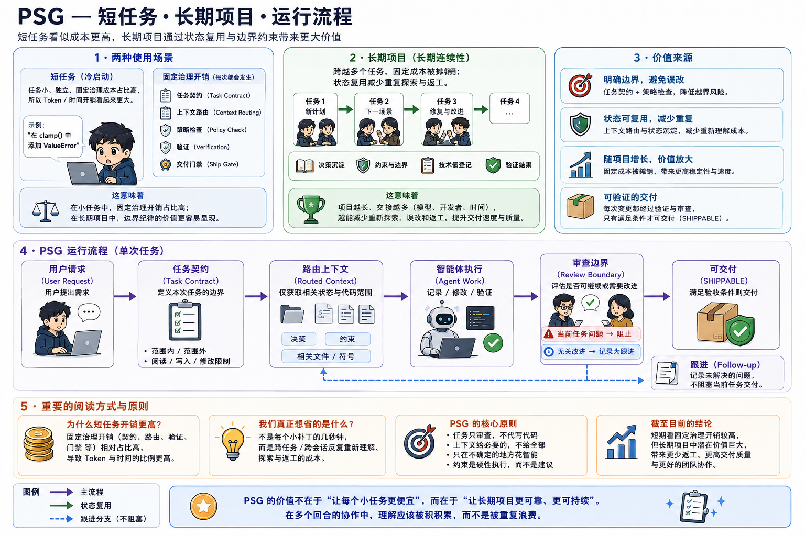

<div align="center">


[English](README.md) · [繁體中文](README.zh-TW.md) · **简体中文** · [日本語](README.ja.md)

</div>

# PSG — 项目状态图

**让 AI coding agent 留在任务范围内、跨工作阶段保留项目决策，并清楚知道工作何时完成。**

PSG 为 coding agent 提供持久的任务边界与项目状态，不再让每个模型重新探索 repository、重新定义工作范围。

## 安装

### Windows

```powershell
python -m pip install "psg-runtime[mcp] @ git+https://github.com/niansia/PSG.git@v1.1.4"; psg setup
```

### macOS / Linux

```bash
python3 -m pip install "psg-runtime[mcp] @ git+https://github.com/niansia/PSG.git@v1.1.4" && psg setup
```

然后在 Git 项目中运行：

```text
psg init
```

就这样。之后照常使用 Codex、Claude Code 或 Gemini CLI。

### 日常控制

```text
psg status
psg on
psg off
```

## PSG 到底在做什么？

没有 PSG 时，coding agent 可能不断发现更多文件、更多重构机会和更多 review 建议，最后让一个小任务变成整个项目的改写。

PSG 为每个任务建立四种边界：

- **Context boundary（上下文边界）** — Agent 需要读取什么。
- **Mutation boundary（修改边界）** — Agent 可以改动什么。
- **Review boundary（审查边界）** — 哪些发现可以阻挡当前任务。
- **Completion boundary（完成边界）** — 任务何时完成、review 何时必须停止。

Reviewer 仍然可以发现无关 bug 或未来可以改进的地方，但 PSG 会把它们记录为 follow-up，而不是悄悄扩大当前任务。

> **Review the task, not the universe. — 审查任务，而不是整个宇宙。**

## 为什么使用 PSG？

### 1. 阻止范围漂移

原本只需要修 A 的任务，不会因为另一个模型又看到 B、C、D 可以改进，就自动变成 A + B + C + D。

### 2. 保留项目决策

已接受的 decision、constraint、frozen boundary 和 known debt，不需要每换一个 Agent 或 session 就重新解释。

### 3. 让 review 收敛

只有当前 patch 造成的 regression、验收条件违规，或项目约束违规可以阻挡当前任务。其他 finding 会保留为 follow-up，不会重新打开任务。

### 4. 知道何时停止

当验收条件、确定性验证、guardrail 和当前任务的 blocker 全部一致时，gate 会返回：

```text
SHIPPABLE
```

一般性 review 到此停止。

## 短任务与长期项目



## 历史 A/B 结果（已被取代）

> **证据状态：Superseded。**

**保留这次测试是为了透明披露，但它不是当前版本性能的证据。当时 Codex 加载的 PSG Skill 比受测 Runtime 更旧，检索集成之后也已改变。**

这次历史测试包含 10 组配对的 Codex CLI 任务，使用相同模型、prompt 和 repository baseline。

| 指标 | PSG OFF | PSG ON |
| --- | ---: | ---: |
| **任务成功** | 9 / 10 | **10 / 10** |
| 非目标文件修改 | 10 | **2** |
| Regression | 0 | 0 |
| 错误的 `SHIPPABLE` | 0 | 0 |

这次历史测试显示出**更好的任务边界纪律，但伴随可测量的 token 与延迟开销**。由于它已被取代，因此不构成当前版本的性能证据；PSG 目前不据此声称能够节省 token 或时间。

完整 protocol、原始结果与限制请见 [Benchmark 文档](benchmarks/README.md)。

## 工作方式


Git 仍然是实现内容的 source of truth。PSG 保存持久的决策和任务状态，而不是完整对话。需要时可以扩大 context，但写入权限不会随之悄悄扩张。

## PSG 可以在哪里使用？

| 模式 | Host | 能力 |
| --- | --- | --- |
| **完整执行** | Codex、Claude Code、Gemini CLI | 读取、修改、验证、强制边界与 ship |
| **Review / handoff** | ChatGPT、Claude、Gemini | 按照同一份 Task Contract 进行审查 |

所有 host 都能使用同一份 Task Boundary；完整执行端另外会受到 runtime 强制保护。使用 `psg handoff` 可以为其他模型或协作者建立精简的 review pack。

## 当前限制

- 完整的 symbol indexing 以 Python 为主，其他语言目前以文件层级建立索引。
- 收录的 agentic benchmark 使用小型生成 repository，不是真实生产项目。
- 当前定位行为仍需要一次新的配对 A/B 测试。
- PSG 尚未提供经过身份验证的外部 CI attestation adapter。
- PSG 负责治理和评估变更；实际修改代码的仍是 coding agent。

## 详细文档

- [安装与 host 设置](docs/installation.md)
- [Task Contract 与 review boundary](docs/task-contract.md)
- [信任与安全模型](docs/trust-and-security.md)
- [CLI 与 MCP 参考](docs/cli-and-mcp.md)
- [架构](docs/architecture.md)
- [验收与 release 证据](docs/acceptance.md)
- [Benchmarks](benchmarks/README.md)
- [研究资料](research/README.md)

另一套 [mechanics regression benchmark](benchmarks/README.md#3-mechanics-regression-benchmark) 会在已知相关目标的前提下，验证 routing 是否能减少选取的 context；它不是端到端 Agent token 节省的声明。

PSG 也正在按长期软件 Agent 研究系统的方向进行评估，详见[评估计划](research/evaluation-plan.md)。

## 许可证

[MIT](LICENSE)
